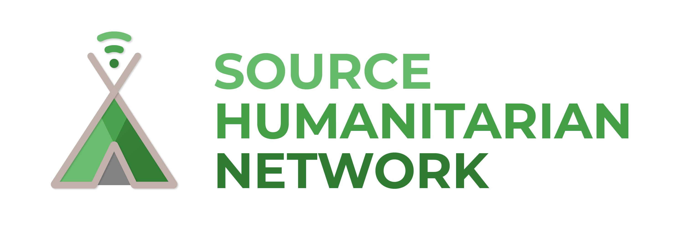

# CSS Proficiency Assessment Anwers

## Section A
> 1. `A`
> 2. `A`
> 3. `B`
> 4. `A`
> 5. `A`
> 6. `B`
> 7. `A`
> 8. `D`
> 9. `D`
> 10. `Any`

## Section B

> 11. `A`
> 12. `A`
> 13. `B`
> 14. `A`
> 15. `B`
> 16. `A`
> 17. `A`
> 18. `A`
> 19. `A`
> 20. `A`
## Section C

> 21. In CSS, padding and margin are two fundamental properties that are used to adjust the spacing of elements. The padding property adds space within an element between its content and its border, while the margin property adds space outside an element between its border and its neighboring elements.

> 22. The `z-index` property in CSS is used to control the stacking order of elements on a web page. It determines which elements are placed in front of or behind others when they overlap. The `z-index` property applies only to elements that have a `position` property value other than `static`, such as `absolute`, `fixed`, or `relative`.

> 23. The box model is a fundamental concept in CSS that describes how elements are structured and laid out on a web page. Every element in CSS is represented as a rectangular box that consists of four layers: content, padding, border, and margin.

> 24. The `float` property in CSS is used to specify the position and alignment of an element in relation to surrounding elements. It is commonly used for creating layouts with multiple columns or for wrapping text around images.

> 25. In CSS, there are two primary types of elements: `inline` and `block`.  Block-level elements are those that create a rectangular box that spans the entire width of their parent container. They start on a new line, and their width, height, padding, margin, and border properties can be set. Examples of block-level elements include `div`, `h1`, `p`, `ul`, and `li`. Inline elements, on the other hand, do not create a new line and only take up as much width as necessary. They are typically used for text or smaller elements and are nested within block-level elements. Inline elements cannot have their width or height set, and their padding, margin, and border properties only affect the content within them. Examples of inline elements include `span`, `a`, `strong`, `em`, `and` `img`.

> 26. The `display` property in CSS is used to control the layout behavior of an HTML element. It specifies how an element should be displayed on the web page

> 27. The `position` property in CSS is used to control the position and layout behavior of an HTML element. It allows developers to specify how an element should be positioned within its parent container

> 28. The key difference between `relative` and `absolute` positioning is that `relative` positioning is based on the normal document flow, while `absolute` positioning is not. This means that an absolutely positioned element can be placed anywhere on the page, regardless of its position in the document flow.

> 29. The `transform` property in CSS is used to apply various types of transformations to HTML elements, such as rotating, scaling, skewing, or translating them in 2D or 3D space. This property allows developers to modify the appearance of an element without affecting its position in the document flow.

> 30. The `@media` rule in CSS is used to specify different styles for different media types, such as different screen sizes or devices. It allows developers to create responsive and adaptive web designs that can adjust their appearance based on the user's device, screen size, or orientation.

### Solidarity Initiative for Refugees

### Source Humanitarian Network

